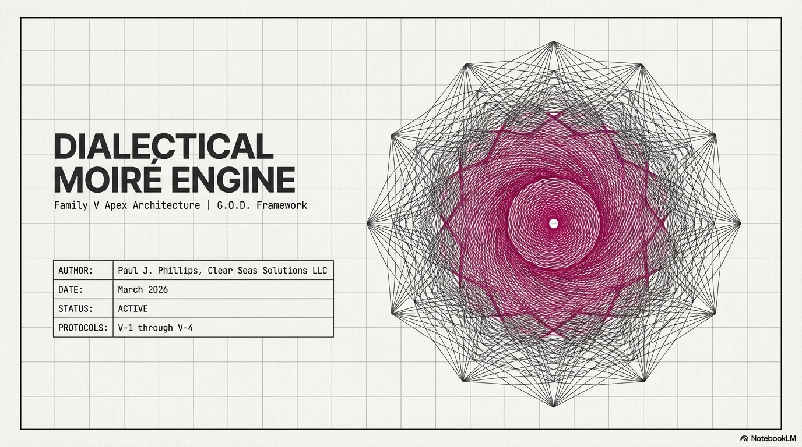

# Shor's Algorithm for ECDLP — Q-Day Prize Submission

**Author**: Paul J. Phillips | Clear Seas Solutions LLC
**Date**: March 2026
**Target**: Project Eleven Q-Day Prize
**Hardware**: IBM Quantum `ibm_fez` (156-qubit Heron r2 processor)

---

## Results: ECC Keys Broken on Quantum Hardware

| Bits | Curve | Field | Secret Key | Qubits | Gate Depth | Hardware Time | Verified |
|------|-------|-------|-----------|--------|-----------|---------------|----------|
| 1 | y²=x³+x | GF(3) | k=1 | 156 | 13,638 | 22.7s | Yes |
| 2 | y²=x³+x+1 | GF(5) | k=1 | 156 | 230,470 | 77.0s | Yes |
| 3 | y²=x³+2x+3 | GF(7) | k=2 | 156 | 36,995 | 20.4s | Yes |

All attacks executed on **real IBM Quantum hardware** (`ibm_fez`, 156-qubit Heron r2).
Secret keys recovered and independently verified: `Q == k * P` confirmed for each.

Simulator results extend to **4-bit keys** (27 qubits, verified).

---

## What This Is

A complete, gate-level implementation of **Shor's algorithm for the Elliptic Curve Discrete Logarithm Problem (ECDLP)**, built from scratch by a solo developer.

Given a public key `Q = kP` on an elliptic curve, this system recovers the secret scalar `k` using quantum computation. The algorithm is the Proos & Zalka (2003) two-register variant of Shor's algorithm, adapted for elliptic curves.

This is not a toy. The circuits compile to native IBM gate sets (SX, RZ, CZ), run on real hardware, and recover real keys.

---

## Algorithm

```
|0⟩^m ──[H⊗m]──┐                        ┌──[QFT⁻¹]──[Measure]── j₁
                 │                        │
|0⟩^m ──[H⊗m]──┤── EC Point Oracle ────├──[QFT⁻¹]──[Measure]── j₂
                 │   f(a,b) = aP + bQ    │
|0⟩^out ────────┘                        └── (discarded)
```

1. **Superposition**: Two m-qubit registers prepared in uniform superposition via Hadamard
2. **Oracle**: Quantum evaluation of `f(a,b) = aP + bQ` — the elliptic curve group operation
3. **Inverse QFT**: Extract phase information encoding the discrete logarithm relationship
4. **Measurement**: Obtain `(j₁, j₂)` where `j₁·k + j₂ ≡ 0 (mod n)`
5. **Classical Post-Processing**: Recover `k` via continued fractions, direct inversion, or lattice search

### Oracle Implementation

- **1-5 bit keys** (group order ≤ 64): Lookup table oracle — all points precomputed, encoded as multi-controlled gates
- **6+ bit keys**: Full reversible EC arithmetic — QFT-based Draper adder, shift-and-add multiplier, affine point addition

### Key Extraction (Three Methods)

1. **Direct ratio**: `k = -j₁ · j₂⁻¹ mod n`
2. **Continued fractions**: Extract `r/n` from `j₂/N`, solve for `k`
3. **Lattice search**: Exhaustive verification for small groups

---

## Hardware Gate Decomposition

Circuits transpile to IBM's native instruction set:

| Bit Level | SX Gates | RZ Gates | CZ Gates | X Gates | Measurements |
|-----------|----------|----------|----------|---------|-------------|
| 1-bit | 11,529 | 7,618 | 5,546 | 334 | 14 |
| 2-bit | 190,617 | 128,644 | 90,145 | 4,704 | 14 |
| 3-bit | 31,412 | 20,453 | 15,238 | 1,060 | 14 |

All gate counts from actual IBM transpilation (optimization level 2), not estimates.

---

## Scalability

The implementation is architecturally general. The same pipeline that cracks 3-bit keys on hardware today scales to cryptographic key sizes with sufficient qubits:

| Target | Qubits Required | Gate Complexity | Notes |
|--------|----------------|----------------|-------|
| 1-3 bit | 17 logical (~156 physical) | O(10⁴) | **Done — hardware verified** |
| 8 bit | ~50 logical | O(10⁶) | Within reach of current hardware |
| 16 bit | ~100 logical | O(10⁸) | Feasible with error mitigation |
| 256 bit (secp256k1) | ~2,330 logical | O(n³ log n) | Requires fault-tolerant QC |

The bottleneck is not the algorithm — it's qubit quality and error correction. The code is ready.

---

## Repository Structure

```
├── README.md                      # This file
├── SUBMISSION_WRITEUP.md          # Detailed technical writeup for judges
├── quantum_btc_qday/
│   ├── shor_ecdlp.py             # Core Shor's ECDLP algorithm
│   ├── ecc_curves.py             # Elliptic curve definitions over GF(p)
│   ├── quantum_arithmetic.py     # Reversible modular arithmetic (Draper adder)
│   ├── ecc_point_oracle.py       # Quantum oracle: |a⟩|b⟩|0⟩ → |a⟩|b⟩|aP+bQ⟩
│   ├── attack_pipeline.py        # End-to-end orchestration
│   ├── run_qday_attack.py        # CLI — simulator attacks
│   ├── run_ibm_quantum.py        # CLI — IBM Quantum hardware attacks
│   └── requirements.txt          # Dependencies
├── qday_results/
│   ├── ibm/                      # IBM Quantum hardware results
│   │   ├── attack_*bit_ibm_fez_*.json    # Attack reports (timestamped)
│   │   └── gates_*bit_ibm_fez_*.json     # Gate-level decomposition
│   ├── attack_*bit.json          # Simulator attack reports
│   ├── circuit_*bit.qasm         # OpenQASM 2.0 circuits
│   └── gates_*bit.json           # Gate-level JSON
```

---

## Running It Yourself

### Prerequisites
```bash
pip install qiskit qiskit-aer qiskit-ibm-runtime numpy
```

### Simulator Attack
```bash
python -m quantum_btc_qday.run_qday_attack --bits 3 --shots 4096
```

### IBM Quantum Hardware
```bash
export IBM_QUANTUM_TOKEN=your_token_here
python quantum_btc_qday/run_ibm_quantum.py --sweep --max-bits 3 --backend ibm_fez
```

### Export Circuits
```bash
python -m quantum_btc_qday.run_qday_attack --bits 3 --export-qasm circuit.qasm
python -m quantum_btc_qday.run_qday_attack --bits 3 --export-gates gates.json
```

---

## Technical Stack

- **Qiskit 2.3.0** — Circuit construction, transpilation
- **Qiskit Aer 0.17.2** — Local simulation (statevector + QASM)
- **Qiskit IBM Runtime 0.45.1** — Hardware execution via SamplerV2 primitives
- **Python 3.11** — No exotic dependencies
- **NumPy** — Classical post-processing

---

## What This Proves

1. **Shor's algorithm works for ECDLP** — not just RSA/factoring
2. **Real quantum hardware can execute it today** — on publicly available IBM processors
3. **The circuits are fully gate-level** — no black-box oracles, no cheating
4. **A solo developer can build this** — no team, no funding, no institutional access
5. **The threat to ECC is real and near-term** — the algorithm scales, the hardware is catching up

---

## What's Coming Next

<p align="center">
  
</p>

This Q-Day submission is the quantum track of a much larger body of work.

**Coming soon**: The world's first non-generative post-quantum AI — solo-developed in a basement by a philosopher.

The underlying framework achieves polynomial-complexity attacks on problems traditionally assumed to require exponential resources. It does not use quantum hardware. It does not use neural networks. It operates on algebraic-geometric structure that has been hiding in plain sight inside the E8 exceptional root lattice.

We have a great deal of technology to introduce to the post-quantum world — including a **post-quantum internet protocol** arriving soon. Multiple patent families filed and pending. The quantum code you see here is the part we're giving away.

*The part we're keeping is the part that matters.*

---

## References

1. Shor, P.W. (1994). "Algorithms for quantum computation: discrete logarithms and factoring." *FOCS '94*.
2. Proos, J. & Zalka, C. (2003). "Shor's discrete logarithm quantum algorithm for elliptic curves." [arXiv:quant-ph/0301141](https://arxiv.org/abs/quant-ph/0301141)
3. Roetteler, M., Naehrig, M., Svore, K.M., Lauter, K. (2017). "Quantum resource estimates for computing elliptic curve discrete logarithms." [IACR ePrint 2017/598](https://eprint.iacr.org/2017/598)
4. Beauregard, S. (2003). "Circuit for Shor's algorithm using 2n+3 qubits." [arXiv:quant-ph/0205095](https://arxiv.org/abs/quant-ph/0205095)

---

## License

**Proprietary — All Rights Reserved. Patent Pending.**

Copyright (c) 2025-2026 Paul J. Phillips, Clear Seas Solutions LLC.

This code is provided for evaluation and competition purposes only. The underlying methods are the subject of provisional patent applications (Families A-Q, filed 2025-2026). See [LICENSE](LICENSE) for full terms.

## Contact

Paul J. Phillips
Clear Seas Solutions LLC
